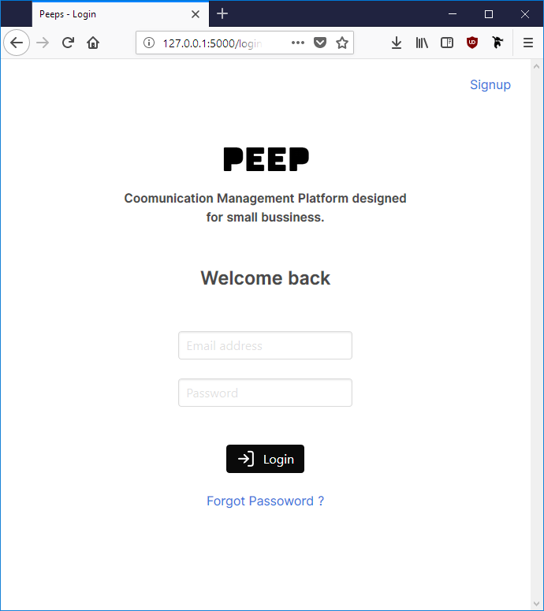
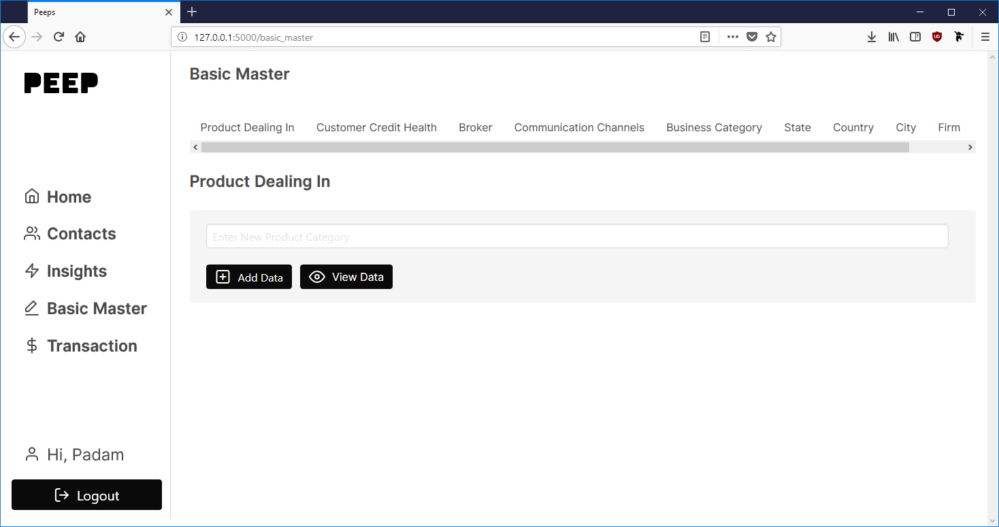
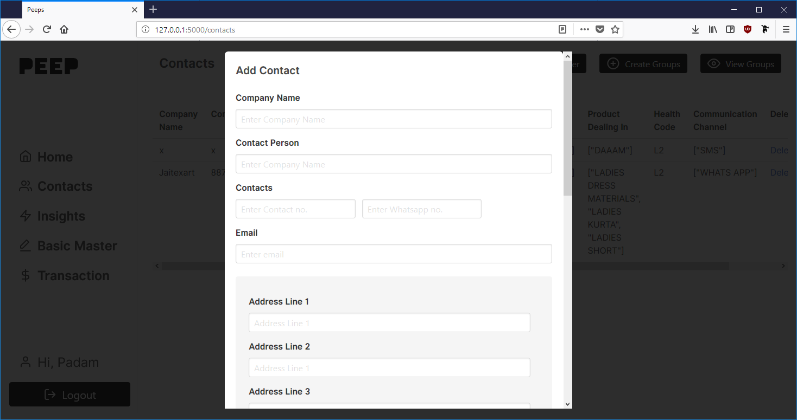
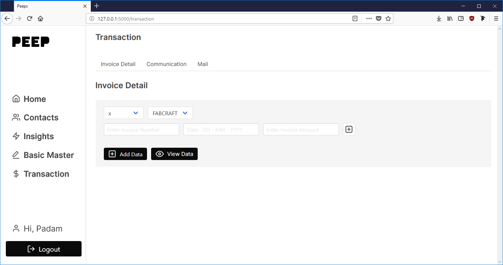
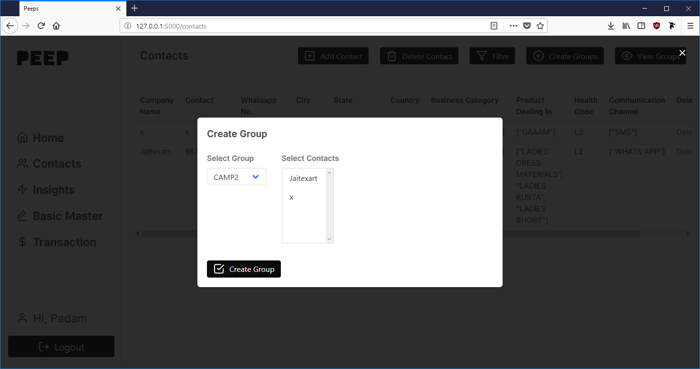

     

 
 

Simple and open marketing application to track the return on any marketing campaigns. Ideally built for small businesses that do not have much sophisticated requirements.

## Screenshots

<table>
  <tr>
    <td align="center">
      
       
      <em>Login Page</em>
    </td>
    <td align="center">
      
       
      <em>Basic Master</em>
    </td>
    <td align="center">
      
       
      <em>Add Contacts</em>
    </td>
    <td align="center">
      
       
      <em>Transactions</em>
    </td>
    <td align="center">
      
       
      <em>Create Groups</em>
    </td>
  </tr>
</table>

## ⚡ Features

 * Contacts Dashboard to create and edit contacts . 
 * Group contacts for efficient management , tracking and campaigns.
 * Send mails directly from Peep.
 * Add Invoices
 * Hack it easily for your use !
 * Get Insights 
 * Fully Responsive

## 🏗 In Works

 * Graphs for Insights 
 * Export / Import option for Contacts data
 * and more ..

